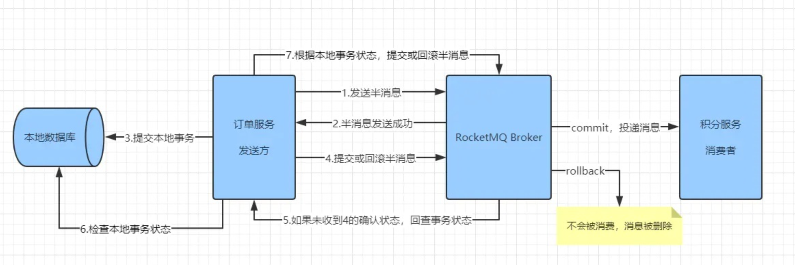
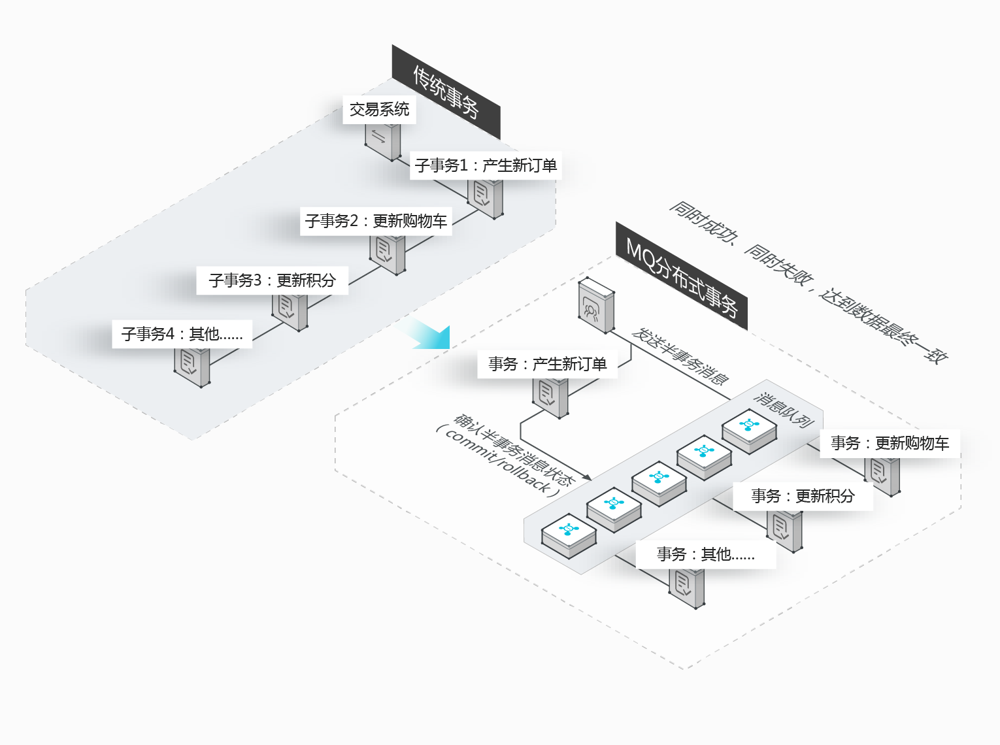

# rmq demo

本地docker 启动。MQ简单逻辑后续其实可以做在FaaS中，支持弹性扩缩容。

### deploy

* [本地调试部署](./deploy/local/README.md)

### demos

* [发送消息](./demos/send_msg)
    * [同步发送消息](./demos/send_msg/src/main/java/com/example/demo/SyncSendMessageProducer.java)
    * [异步](./demos/send_msg/src/main/java/com/example/demo/ASyncSendMessageProducer.java)
    * [单向](./demos/send_msg/src/main/java/com/example/demo/OneWaySendMessageProducer.java)
* [顺序消息](./demos/order_msg)
    * 生产
        * [全局有序](./demos/order_msg/src/main/java/com/example/demo/SingleQueueOrderProducer.java)： 只能是设置一个分区就可以
        * [分区顺序](./demos/order_msg/src/main/java/com/example/demo/MultiQueueOrderProducer.java)： 通过ShardingKey固定到queue
        * [BadCase](./demos/order_msg/src/main/java/com/example/demo/OneTopicMultiQueueProducer.java)： 单个topic设置多个队列且没有使用ShardingKey
    * 消费
        * [全局有序](./demos/order_msg/src/main/java/com/example/demo/SingleQueueOrderConsumer.java)： 注意消费者使用`MessageListenerOrderly`
        * [分区顺序](./demos/order_msg/src/main/java/com/example/demo/MultiQueueOrderConsumer.java)： 通过一个消费线程对应一个queue
        * [BadCase](./demos/order_msg/src/main/java/com/example/demo/OneTopicMultiQueueConsumer.java)
* [延迟消息](./demos/delay_msg/src/main/java/com/example/demo)
* [消息可靠性](./demos/lose_msg)
    * 发送不丢失： [消息重投](./demos/lose_msg/src/main/java/com/example/demo/ResendProducer.java)
    * 存储不丢失： 这里不管，总结下broker的可靠性如何保证就行
    * 消费不丢失： [消息重试](./demos/lose_msg/src/main/java/com/example/demo/RetryConsumer.java)
* [死信队列](./demos/lose_msg)
* 回溯消费: [link1](./demos/order_msg/src/main/java/com/example/demo/MultiQueueOrderConsumer.java)
```text
* enum org.apache.rocketmq.common.consumer.ConsumeFromWhere
    CONSUME_FROM_LAST_OFFSET: 从最后的偏移量开始消费
    CONSUME_FROM_FIRST_OFFSET：从最小偏移量开始消费
    CONSUME_FROM_TIMESTAMP：从某个时间开始消费 
* 控制台 -> topic -> 重置消费位点 -> 设置 订阅组 和 时间点 -> 提交即可
```
* [批量消息](./demos/batch_msg)
    * [批量发送消息](./demos/batch_msg/src/main/java/com/example/demo/BatchSendMsgProducer.java)
    * [消息切分发送](./demos/batch_msg/src/main/java/com/example/demo/BatchSendSplitMsgListProducer.java)
    * [批量消费消息](./demos/batch_msg/src/main/java/com/example/demo/BatchReceiverMsgConsumer.java)
* [过滤消息](./demos/filter_msg)
    * [消息打tag发送](./demos/filter_msg/src/main/java/com/example/demo/SendMsgByTagProducer.java)
    * [过滤tag接收消息](./demos/filter_msg/src/main/java/com/example/demo/ReceiverMsgByFilterTagConsumer.java)
    * [消息打属性发送](./demos/filter_msg/src/main/java/com/example/demo/SendMsgByPropertyProducer.java)
    * [过滤属性接收消息](./demos/filter_msg/src/main/java/com/example/demo/ReceiverMsgByFilterPropertyConsumer.java)
* [事务消息](./demos/transaction_msg)
```text
三个服务： 商品服务、订单服务、用户积分服务。
用户创单后，就算商品库存没有正常扣减、用户积分没有对应增加 也不管了，保证用户下单时候的核心事务执行成功就行，后续再进行商品库存扣减和用户积分增加修复， 最大限度地保证下单成功。
用于： 核心事务和非核心事务解耦（不能说用户积分服务异常就导致用户无法创单）
```


* [cutoff] 日志格式
* [ ] OMS(OpenMessaging)
* 消息轨迹
```java
new DefaultMQProducer("ProducerGroupName",true);
new DefaultMQPushConsumer("CID_JODIE_1",true);

// 指一条消息从生产者发送到消息队列RocketMQ版服务端，再到消费者消费，整个过程中的各个相关节点的时间、状态等数据汇聚而成的完整链路信息。
// 类似traceId排查问题用的
```
* 优化消费速度
```txt
* 提高消费并行度
    * 加机器
    * 多线程 consumeThreadMin、consumeThreadMax
        DefaultMQPushConsumer consumer = new DefaultMQPushConsumer("topic_name");
        consumer.setConsumeThreadMax(100); // 默认是20
        consumer.setConsumeThreadMax(50); // 默认是20
* 批量方式消费
    DefaultMQPushConsumer consumer = new DefaultMQPushConsumer("topic_name");
    consumer.setConsumeMessageBatchMaxSize(10); // 默认是1
* 跳过非重要消息
    consumer.registerMessageListener(new MessageListenerConcurrently() {
        @Override
        public ConsumeConcurrentlyStatus consumeMessage(List<MessageExt> messages, ConsumeConcurrentlyContext context) {
            long offset = messages.get(0).getQueueOffset();
            String maxOffset = messages.get(0).getProperty(MessageConst.PROPERTY_MAX_OFFSET);
            long diff = Long.parseLong(maxOffset) - offset;
            if (diff > 100000) {
                // 消息堆积情况的特殊处理...
                return ConsumeConcurrentlyStatus.CONSUME_SUCCESS;
            }
            // 正常消费过程...
            return ConsumeConcurrentlyStatus.CONSUME_SUCCESS;
        }
    }
* 优化每条消息消费过程
```
* [ ] [轻消息队列](./demos/lmq_msg)
* [ ] [消息幂等](./demos/idempotent_msg)

### abstract biz framework

**Feature：**
1. 告警监控
2. producer/consumer 支持重试
3. 多次重试失败支持存储到DB
4. 支持切面对业务代码无侵入添加逻辑
5. 自动分区sharding队列

TODO: 待完善

这里以RMQ为例，应当也无缝切换支持kafka。

### ref

* https://github.com/apache/rocketmq/blob/master/docs/cn/RocketMQ_Example.md
* https://help.aliyun.com/document_detail/29543.html
